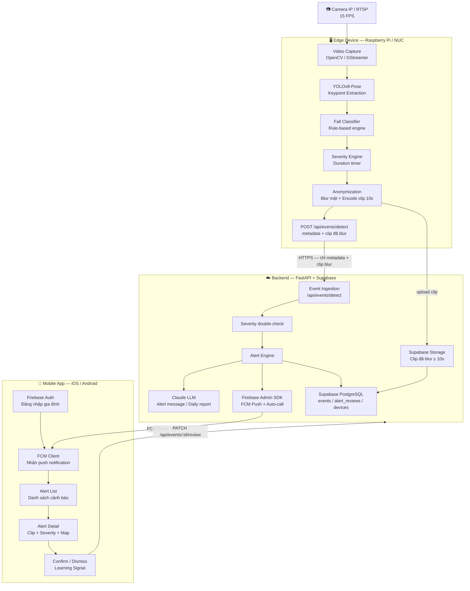
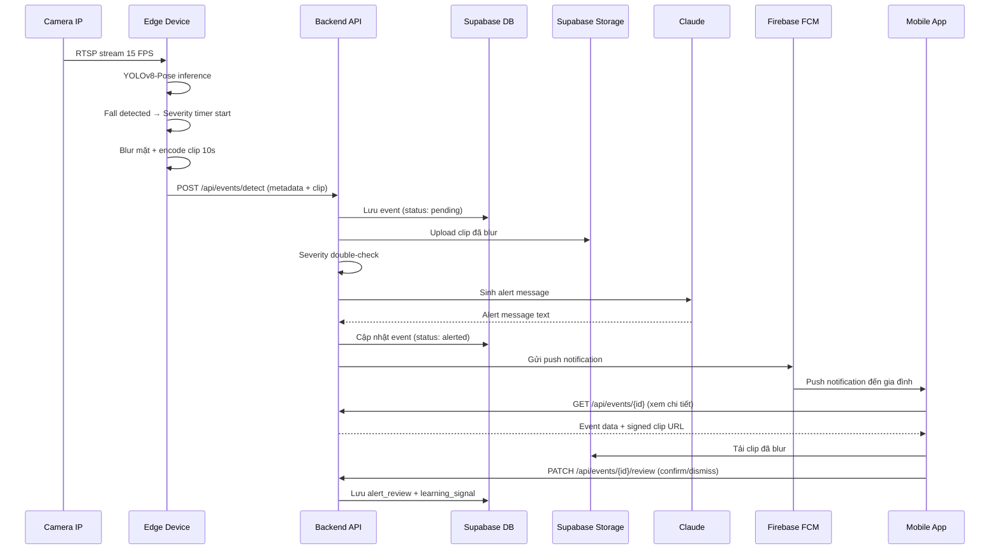

# 🏗️ Kiến trúc hệ thống — SilentGuard AI

> **Team 128** · Mentor: Công Nguyễn · AI20K Build Cohort 2

---

## Tổng quan

SilentGuard AI vận hành theo mô hình **3 lớp tách biệt**: Edge Device xử lý video thô tại chỗ và chỉ truyền metadata + clip đã ẩn danh lên Backend; Backend điều phối toàn bộ alert logic và tích hợp LLM; Mobile App là giao diện duy nhất để gia đình nhận cảnh báo và phản hồi. Kiến trúc này đảm bảo raw video không bao giờ rời khỏi thiết bị edge, đồng thời cho phép scale backend độc lập.

---

## Sơ đồ kiến trúc



---

## Chi tiết từng component

### 1. Edge Device (Raspberry Pi 4B / Intel NUC)

Edge Device là **vành đai bảo mật** của hệ thống — toàn bộ video thô được xử lý và hủy tại đây.

| Bước | Module | Mô tả |
|---|---|---|
| **Video Capture** | OpenCV / GStreamer | Kết nối RTSP, pull frame 15 FPS |
| **Keypoint Extraction** | YOLOv8-Pose | Trích xuất 17 skeleton keypoints/người |
| **Fall Classifier** | Rule-based engine | Phát hiện tư thế ngã dựa trên góc hông, đầu gối, tốc độ di chuyển keypoint |
| **Severity Engine** | Duration timer | Bắt đầu đếm thời gian bất động sau khi phát hiện ngã |
| **Anonymization** | OpenCV face blur | Làm mờ mặt theo bounding box → encode clip H.264 10 giây |
| **Event POST** | `requests` / `httpx` | Gửi `{event_type, severity, confidence, keypoints, clip}` lên Backend |

**Ràng buộc kỹ thuật:**
- Raw frame **không được ghi xuống disk** — chỉ tồn tại trong RAM vòng lặp xử lý.
- Inference phải hoàn thành trong **< 50ms/frame** để giữ độ trễ tổng < 60 giây.
- Edge hoạt động **offline** khi mất kết nối — queue event local, gửi lại khi online.

---

### 2. Backend API (FastAPI + Supabase)

Backend là **trung tâm điều phối** — nhận event từ edge, phân loại lại, kích hoạt alert, và cung cấp API cho mobile.

#### Luồng xử lý event

```
POST /api/events/detect
        ↓
Verify Firebase device token (hoặc API key edge)
        ↓
Lưu event vào Supabase (status: pending)
        ↓
Severity double-check (so sánh severity edge vs backend logic)
        ↓
[Nếu severity ≥ MEDIUM]
        ↓
Alert Engine:
  → Claude LLM: sinh alert message tự nhiên
  → Firebase Admin: gửi FCM push đến gia đình
  → [Nếu HIGH/CRITICAL]: kích hoạt auto-call logic
  → Cập nhật event status: alerted
        ↓
Clip upload URL → trả về cho edge → edge upload Supabase Storage
```

#### Alert Engine logic

```python
if severity == "LOW":
    log_only()
elif severity == "MEDIUM":
    send_fcm_push(contacts)
elif severity == "HIGH":
    send_fcm_push(contacts)
    initiate_auto_call(primary_contact)
elif severity == "CRITICAL":
    send_fcm_push(all_emergency_contacts)
    call_all_contacts_loop()
```

#### Claude LLM — 3 use case

| Use case | Input | Output |
|---|---|---|
| Alert message | `{severity, duration, location, time}` | Tin nhắn push tự nhiên, đủ thông tin, không hoảng loạn |
| Daily report | `{event_list, review_list, stats}` | Báo cáo ngày tóm tắt tình trạng sức khỏe |
| Config parser | Cấu hình ngôn ngữ tự nhiên từ caregiver | Threshold và rule JSON có thể dùng cho Severity Engine |

---

### 3. Mobile App (Firebase Auth + FCM)

Mobile App là **giao diện duy nhất** cho gia đình và caregiver — không có dashboard web trong MVP.

| Màn hình | Chức năng |
|---|---|
| **Login** | Firebase Auth (Email/Password hoặc Google) |
| **Home** | Trạng thái edge device (online/offline), severity gần nhất |
| **Alert List** | Danh sách cảnh báo, lọc theo ngày / severity |
| **Alert Detail** | Xem clip đã blur, thông tin severity, vị trí camera, AI confidence |
| **Confirm / Dismiss** | Xác nhận sự kiện thật hoặc false positive → gửi learning signal |

**FCM token flow:**
1. App đăng nhập → lấy Firebase ID Token.
2. Gửi FCM registration token lên `POST /api/users/fcm-token`.
3. Backend lưu token → dùng để push notification về sau.

---

## Database Schema (Supabase PostgreSQL)

### Bảng `events`

```sql
CREATE TABLE events (
    id              UUID PRIMARY KEY DEFAULT gen_random_uuid(),
    device_id       UUID NOT NULL REFERENCES devices(id),
    event_type      TEXT NOT NULL,                    -- 'fall', 'lying_still', 'normal'
    severity        TEXT NOT NULL,                    -- 'LOW', 'MEDIUM', 'HIGH', 'CRITICAL'
    confidence      FLOAT NOT NULL,                   -- 0.0 – 1.0 (AI confidence)
    timestamp       TIMESTAMPTZ NOT NULL DEFAULT now(),
    clip_url        TEXT,                             -- Supabase Storage URL (clip đã blur)
    status          TEXT DEFAULT 'pending',           -- 'pending', 'alerted', 'reviewed', 'false_positive'
    ai_model_version TEXT,                            -- 'yolov8n-pose-v1.2'
    duration_seconds INT,                             -- thời gian bất động (giây)
    created_at      TIMESTAMPTZ DEFAULT now()
);
```

### Bảng `alert_reviews`

```sql
CREATE TABLE alert_reviews (
    id              UUID PRIMARY KEY DEFAULT gen_random_uuid(),
    event_id        UUID NOT NULL REFERENCES events(id),
    reviewer_id     UUID NOT NULL REFERENCES users(id),
    action          TEXT NOT NULL,        -- 'confirm', 'dismiss', 'escalate'
    note            TEXT,                 -- ghi chú tùy ý từ gia đình
    learning_signal BOOLEAN DEFAULT FALSE, -- có dùng để retrain model không
    reviewed_at     TIMESTAMPTZ DEFAULT now()
);
```

### Bảng `devices`

```sql
CREATE TABLE devices (
    id          UUID PRIMARY KEY DEFAULT gen_random_uuid(),
    name        TEXT NOT NULL,            -- 'Camera phòng khách'
    location    TEXT,                     -- 'Phòng khách, tầng 1'
    owner_id    UUID NOT NULL REFERENCES users(id),
    status      TEXT DEFAULT 'offline',   -- 'online', 'offline', 'error'
    last_seen   TIMESTAMPTZ,
    api_key     TEXT UNIQUE NOT NULL,     -- dùng để edge device authenticate
    created_at  TIMESTAMPTZ DEFAULT now()
);
```

### Bảng `users`

```sql
CREATE TABLE users (
    id                  TEXT PRIMARY KEY,   -- Firebase UID
    email               TEXT UNIQUE NOT NULL,
    name                TEXT,
    role                TEXT DEFAULT 'family', -- 'family', 'caregiver', 'admin'
    emergency_contacts  JSONB DEFAULT '[]', -- [{name, phone, fcm_token}]
    fcm_token           TEXT,               -- FCM registration token thiết bị
    created_at          TIMESTAMPTZ DEFAULT now()
);
```

---

## API Contract

| Method | Endpoint | Mô tả | Auth |
|---|---|---|---|
| `POST` | `/api/events/detect` | Edge gửi event phát hiện té ngã | API Key (device) |
| `GET` | `/api/events` | Lấy danh sách event (phân trang, lọc) | Firebase ID Token |
| `GET` | `/api/events/{id}` | Chi tiết một event | Firebase ID Token |
| `PATCH` | `/api/events/{id}/review` | Gia đình confirm / dismiss event | Firebase ID Token |
| `GET` | `/api/devices` | Danh sách thiết bị của user | Firebase ID Token |
| `POST` | `/api/users/fcm-token` | Đăng ký / cập nhật FCM token | Firebase ID Token |
| `GET` | `/api/reports/daily` | Báo cáo ngày (Claude LLM) | Firebase ID Token |

---

## Privacy Architecture

```
┌──────────────────────────────────────────────────────────┐
│                    EDGE DEVICE                           │
│                                                          │
│  Camera frame (raw)                                      │
│       │                                                  │
│       ▼ [chỉ trong RAM]                                 │
│  YOLOv8 inference → keypoints + face bbox               │
│       │                                                  │
│       ▼                                                  │
│  Face blur (Gaussian, kernel 51x51 trên bbox)           │
│       │                                                  │
│       ▼                                                  │
│  Encode clip 10s (H.264, 480p, không có metadata EXIF)  │
│       │                                                  │
│  Raw frame bị hủy (không ghi disk, không buffer thêm)  │
│       │                                                  │
└───────┼──────────────────────────────────────────────────┘
        │  HTTPS POST (multipart/form-data)
        ▼
┌──────────────────────────────────────────────────────────┐
│                    CLOUD                                 │
│                                                          │
│  Chỉ nhận: metadata JSON + clip đã blur                 │
│  Supabase Storage: lưu clip (tự xóa sau 30 ngày)       │
│  PostgreSQL: lưu metadata, không lưu ảnh raw            │
│                                                          │
└──────────────────────────────────────────────────────────┘
```

**Cam kết không thể phá vỡ:**
- ❌ Server không bao giờ nhận raw frame.
- ❌ Edge không bao giờ ghi raw frame xuống disk.
- ❌ Clip cloud không đủ để nhận diện danh tính.
- ✅ Chỉ skeleton keypoints + clip blur được truyền.

---

## Bảo mật

| Lớp | Cơ chế |
|---|---|
| **Edge → Backend** | API Key duy nhất per device, lưu trong `.env` edge |
| **Mobile → Backend** | Firebase ID Token (JWT), verify bằng Firebase Admin SDK |
| **Transport** | HTTPS (TLS 1.3) bắt buộc cho mọi kết nối |
| **Storage** | Supabase Storage private bucket, chỉ truy cập qua signed URL |
| **Secrets** | Không hardcode key — dùng environment variables |

---

## Sequence Diagram — Luồng phát hiện té ngã



---

> 📄 Xem thêm: [README.md](./README.md) · [PROJECT_MAP.md](./PROJECT_MAP.md)
