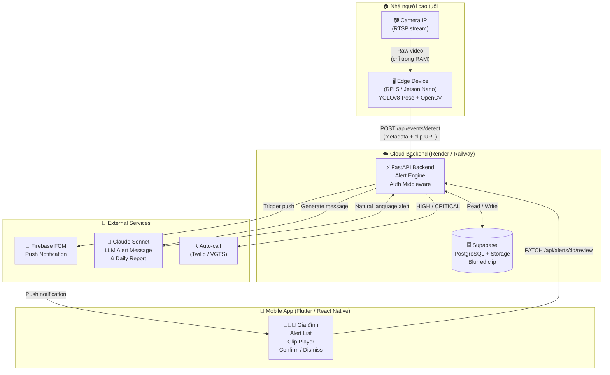
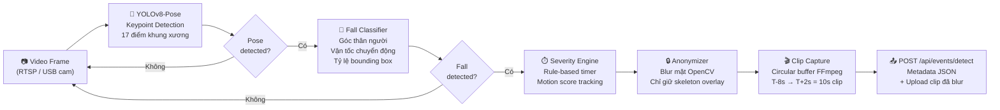
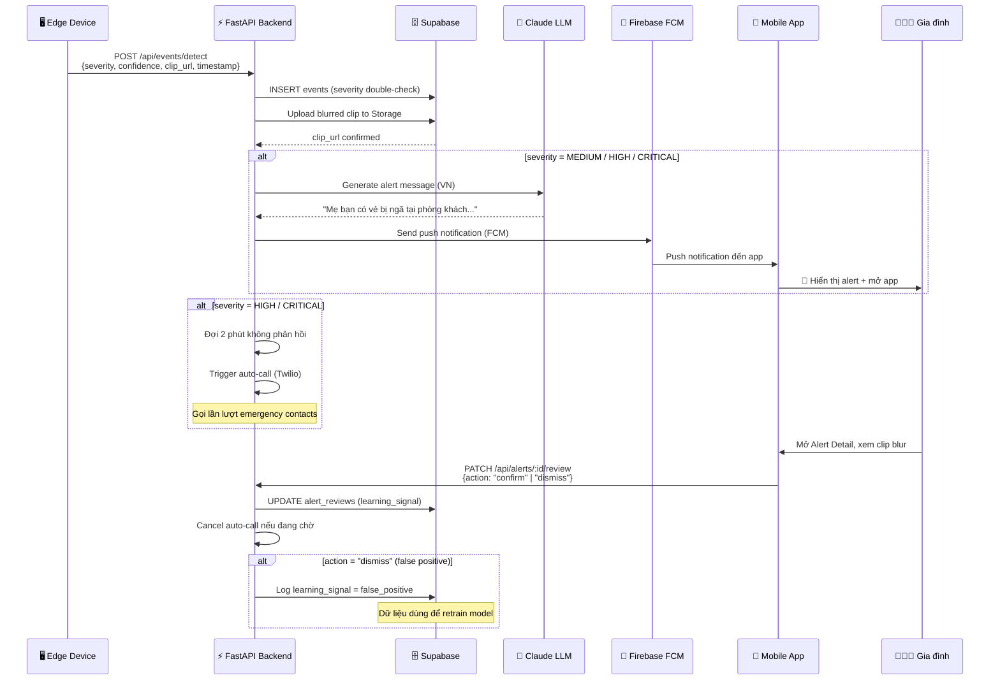
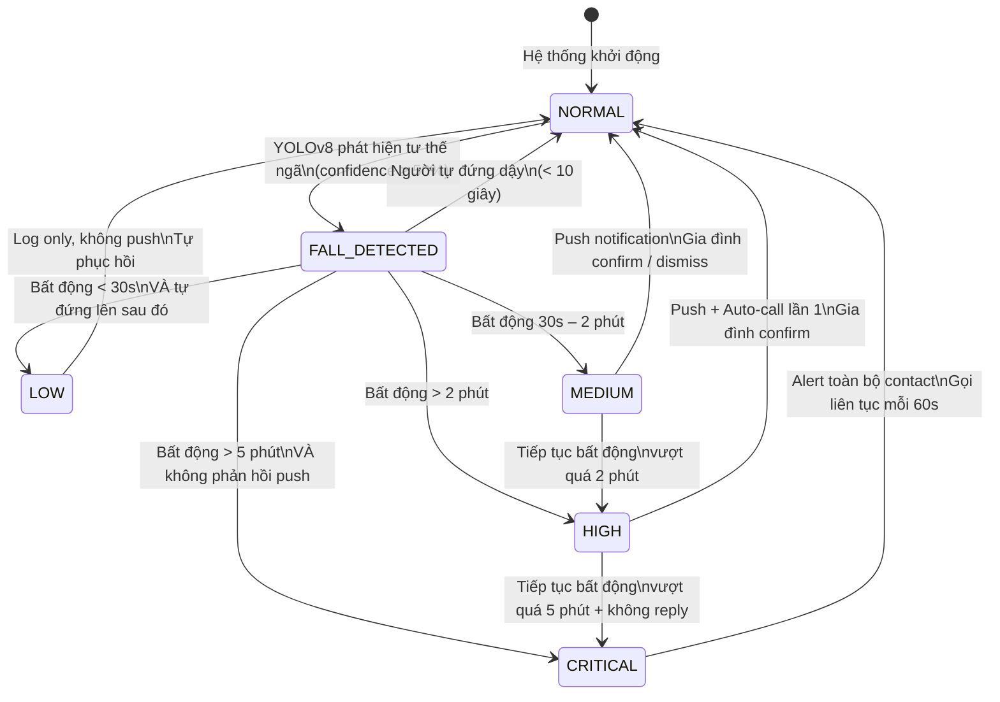
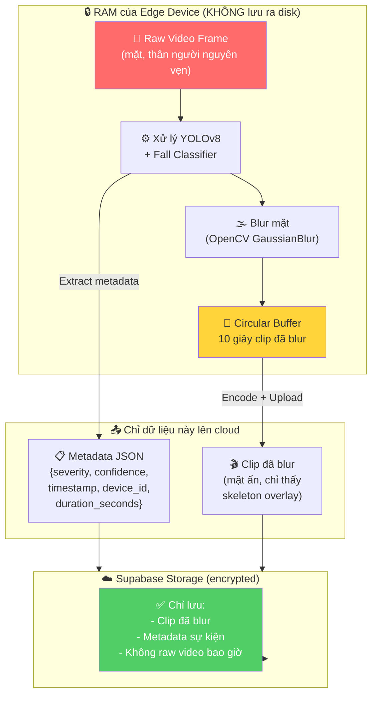

# SilentGuard AI — Sơ đồ Kiến trúc

> Tài liệu này chứa toàn bộ sơ đồ hệ thống SilentGuard AI dưới dạng Mermaid diagram.

---

## 1. System Overview — Tổng quan hệ thống

---

## 2. Edge Device Pipeline — Luồng xử lý tại thiết bị biên

---

## 3. Alert Flow — Luồng xử lý cảnh báo

---

## 4. Severity State Machine — Máy trạng thái mức độ nghiêm trọng

---

## 5. Data Flow & Privacy — Luồng dữ liệu và quyền riêng tư

> ⚠️ **Cam kết privacy**: Raw video tuyệt đối không rời khỏi RAM của edge device.  
> Mọi dữ liệu lên cloud đã qua bước blur mặt. Clip tự xóa khỏi RAM sau khi upload xong.

---

## 6. DB Schema — Sơ đồ cơ sở dữ liệu (Supabase / PostgreSQL)

```mermaid
flowchart LR
    subgraph USERS["users"]
        U1["id (Firebase UID)"]
        U2["email"]
        U3["name"]
        U4["role"]
        U5["emergency_contacts (jsonb)"]
        U6["notification_settings (jsonb)"]
    end

    subgraph DEVICES["devices"]
        D1["id (uuid)"]
        D2["name"]
        D3["location"]
        D4["owner_id → users.id"]
        D5["status (online/offline)"]
        D6["last_seen (timestamp)"]
        D7["config_json (jsonb)"]
    end

    subgraph EVENTS["events"]
        E1["id (uuid)"]
        E2["device_id → devices.id"]
        E3["event_type (fall/anomaly)"]
        E4["severity (LOW/MED/HIGH/CRIT)"]
        E5["confidence (float 0–1)"]
        E6["timestamp"]
        E7["clip_url (Supabase Storage)"]
        E8["status (pending/reviewed)"]
        E9["ai_model_version"]
        E10["duration_seconds (float)"]
        E11["created_at"]
    end

    subgraph ALERT_REVIEWS["alert_reviews"]
        R1["id (uuid)"]
        R2["event_id → events.id"]
        R3["reviewer_id → users.id"]
        R4["action (confirm/dismiss/escalate)"]
        R5["note (text)"]
        R6["learning_signal (jsonb)"]
        R7["reviewed_at"]
    end

    USERS -->|"1 owns nhiều"| DEVICES
    DEVICES -->|"1 tạo nhiều"| EVENTS
    EVENTS -->|"1 có nhiều"| ALERT_REVIEWS
    USERS -->|"1 review nhiều"| ALERT_REVIEWS
```

