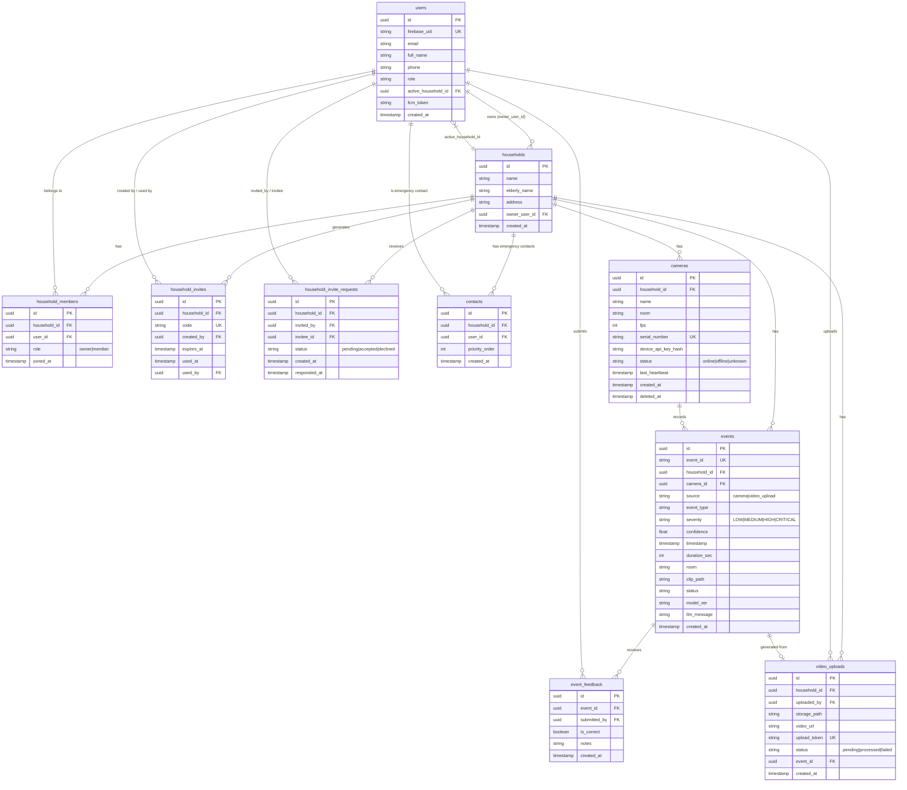

# SilentGuard Database Schema (Supabase)

Tài liệu này mô tả sơ đồ cơ sở dữ liệu quan hệ (Entity-Relationship Diagram) của dự án SilentGuard.

## 1. Entity-Relationship Diagram (ERD)

Sơ đồ dưới đây được vẽ bằng MermaidJS, thể hiện cấu trúc các bảng và mối quan hệ giữa chúng.

## 2. Ghi chú Ràng buộc Cơ sở dữ liệu (Constraints)
- **Unique Constraints (UK):**
  - `users.firebase_uid`: Không cho phép 2 tài khoản trùng UID Firebase.
  - `cameras.serial_number`: Đảm bảo không có 2 camera dùng chung 1 số Serial phần cứng.
  - `household_invites.code`: Mã mời gia đình là duy nhất.
  - `events.event_id`: Tránh ghi nhận trùng lặp cùng 1 sự kiện từ AI server.
  - `video_uploads.upload_token`: Token tạm thời sinh ra ngẫu nhiên cho mỗi video.
  - `event_feedback(event_id, submitted_by)`: Composite Unique Key để đảm bảo 1 người chỉ được phản hồi 1 lần cho 1 sự kiện.
- **Cascading & Security:**
  - `events` có khóa ngoại trỏ về `households` và `cameras` để đảm bảo khi xóa gia đình, các sự kiện có thể được cascade.
  - Tầng mã nguồn sử dụng cơ chế **Optimistic Locking** (ví dụ với bảng `household_invites`) để chặn các lỗ hổng Race Condition khi truy xuất dữ liệu đồng thời.
