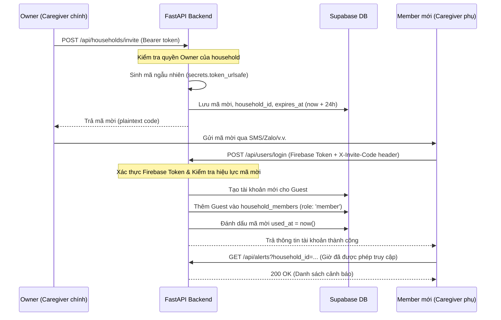

# Phân Quyền Hạn Trong Hệ Thống (RBAC - Role-Based Access Control) — SilentGuard

Tài liệu này mô tả chi tiết cơ chế phân quyền dựa trên vai trò (RBAC) được áp dụng tại Backend SilentGuard để bảo vệ dữ liệu hộ gia đình và đảm bảo an ninh hệ thống.

---

## 1. Định Nghĩa Các Vai Trò (Roles)

Hệ thống phân chia quyền hạn thành 3 đối tượng chính:

| Vai trò | Phạm vi | Mô tả |
|---|---|---|
| **Owner (Chủ hộ)** | Người dùng gia đình (Caregiver chính) | Có toàn quyền quản trị hộ gia đình: Cấu hình ngưỡng báo động, quản lý danh bạ khẩn cấp, thêm/xóa camera, tạo mã mời thành viên khác tham gia. |
| **Member (Thành viên)** | Người nhà / Người hỗ trợ phụ | Có quyền xem thông tin: Nhận push notification, xem danh sách sự kiện ngã, xem video clip, xem dashboard và báo cáo ngày do AI tổng hợp. Không thể thay đổi cấu hình hệ thống. |
| **Edge Device (Thiết bị Camera)** | Thiết bị biên (Raspberry Pi / NUC) | Vai trò đặc biệt chỉ được phép gửi dữ liệu sự kiện (`POST /api/events/detect`) và xin URL tải video (`POST /api/cameras/upload-url`). Không có quyền truy cập API của người dùng. |

---

## 2. Bảng Phân Quyền API (Permission Matrix)

Dưới đây là chi tiết quyền hạn truy cập của từng endpoint:

| Phân hệ | API Endpoint | Phương thức | Quyền hạn tối thiểu |
|---|---|---|---|
| **Xác thực** | `/api/users/login` | `POST` | Mọi user (Firebase token hợp lệ) |
| | `/api/users/logout` | `POST` | Mọi user (Firebase token hợp lệ) |
| | `/api/users/device-token` | `POST` | Mọi user (Đăng ký nhận FCM push) |
| **Hộ gia đình** | `/api/households/me` | `GET` | **Member** trở lên |
| | `/api/households/invite` | `POST` | **Owner** |
| **Cảnh báo** | `/api/alerts` | `GET` | **Member** trở lên (Chỉ hộ gia đình mình) |
| | `/api/events/{event_id}` | `GET` | **Member** trở lên (Chỉ hộ gia đình mình) |
| | `/api/alerts/{event_id}/review` | `PATCH` | **Member** trở lên (Phản hồi sự cố) |
| **Cấu hình** | `/api/settings/thresholds` | `GET` | **Member** trở lên |
| | `/api/settings/thresholds` | `PUT` | **Owner** |
| | `/api/llm/config` | `POST` | **Owner** |
| **Danh bạ** | `/api/contacts` | `GET` | **Member** trở lên |
| | `/api/contacts` | `POST` | **Owner** |
| | `/api/contacts/{id}` | `PATCH` | **Owner** |
| | `/api/contacts/{id}` | `DELETE` | **Owner** |
| **Camera** | `/api/cameras` | `POST` | **Owner** (Đăng ký thiết bị mới) |
| | `/api/cameras` | `GET` | **Member** trở lên |
| | `/api/cameras/{id}/rotate-key` | `PATCH` | **Owner** (Đổi mã kết nối) |
| | `/api/cameras/{id}` | `PATCH` | **Owner** (Sửa thông tin cơ bản) |
| | `/api/cameras/{id}` | `DELETE` | **Owner** (Xóa camera) |
| | `/api/cameras/upload-url` | `POST` | **Edge Device** (Dùng X-Device-Key) |
| **Sự kiện biên**| `/api/events/detect` | `POST` | **Edge Device** (Dùng X-Device-Key) |

---

## 3. Cơ Chế Triển Khai Kỹ Thuật (Implementation Details)

### 3.1 Cấu trúc cơ sở dữ liệu
Việc quản lý thành viên dựa trên bảng [household_members](file:///e:/AI_In_Action/C2-App-128/backend/migrations/002_household_membership.sql#L1-L8) liên kết giữa `users` và `households`:
```sql
CREATE TABLE household_members (
    id              UUID PRIMARY KEY DEFAULT gen_random_uuid(),
    household_id    UUID REFERENCES households(id) ON DELETE CASCADE,
    user_id         UUID REFERENCES users(id) ON DELETE CASCADE,
    role            TEXT NOT NULL CHECK (role IN ('owner', 'member')),
    joined_at       TIMESTAMPTZ DEFAULT now(),
    UNIQUE (household_id, user_id)
);
```

### 3.2 FastAPI Dependency Factory (`require_household_role`)
Backend sử dụng một Dependency Factory tên là `require_household_role(owner_only: bool)` tại [backend/app/core/security.py](file:///e:/AI_In_Action/C2-App-128/backend/app/core/security.py#L261):
1. **Trích xuất `household_id`**: Hàm tự động tìm kiếm `household_id` từ:
   - Path parameters (Ví dụ: `/api/cameras/{household_id}`)
   - Query parameters (Ví dụ: `/api/cameras?household_id=...`)
   - JSON Body (Ví dụ: `/api/cameras` payload)
   - Hoặc tìm kiếm hộ gia đình mặc định mà user đang tham gia nếu không truyền.
2. **Kiểm tra vai trò**:
   - Truy vấn bảng `household_members` để lấy bản ghi của cặp `(household_id, current_user.id)`.
   - Nếu không tồn tại bản ghi → Báo lỗi **`403 FORBIDDEN`**.
   - Nếu `owner_only=True` và vai trò tìm thấy là `member` (không phải `owner`) → Báo lỗi **`403 FORBIDDEN`**.
3. **Đính kèm trạng thái**: Trích xuất thành công sẽ gắn `household_id` và `role` vào `request.state` để route xử lý tiếp theo không cần query lại DB.

---

## 4. Quản Lý Mã Mời (Invitation Flow)

Quy trình mời một thành viên phụ tham gia gia đình diễn ra như sau:



---

## 5. Định Dạng Lỗi Khi Từ Chối Quyền Hạn (403 Forbidden)

Nếu một người dùng cố tình truy cập vào tài nguyên không thuộc hộ gia đình của mình, hoặc tài khoản có vai trò `member` cố tình thay đổi cài đặt hệ thống (`PUT /api/settings/thresholds`), API sẽ trả về mã lỗi **403 Forbidden** với cấu trúc chuẩn:

```json
{
  "detail": {
    "error": {
      "code": "FORBIDDEN",
      "message": "Bạn không có quyền truy cập thông tin gia đình này" // Hoặc "Yêu cầu quyền chủ hộ (owner)"
    }
  }
}
```
